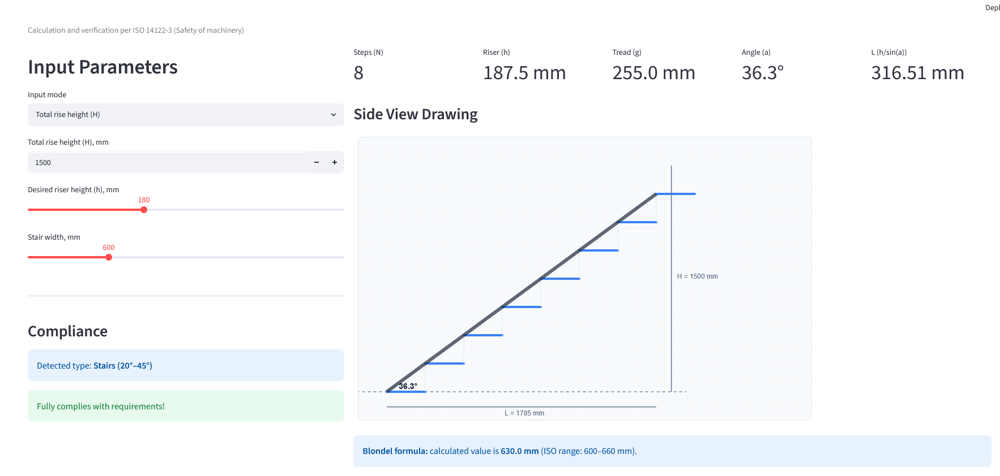

# Industrial Stair Calculator

Streamlit-based calculation and verification tool for industrial stairs per **ISO 14122-3:2016** — *Safety of machinery — Permanent means of access to machinery — Part 3: Stairs, stepladders and guard-rails*.

## Features

- **Three input modes:** Total rise height (H), number of steps (N), or desired inclination angle
- **Automatic stair type detection** — Stairs (20°–45°) or Stepladders (45°–75°) based on the resulting angle
- **ISO 14122-3 compliance checks:**
  - Inclination angle within allowed range
  - Blondel formula (g + 2h) within 600–660 mm for stairs
  - Minimum tread depth: 200 mm (stairs) / 150 mm (stepladders)
  - Maximum riser height: 240 mm (stairs) / 250 mm (stepladders)
  - Minimum stair width: 600 mm (stairs) / 500 mm (stepladders)
- **SVG side-view drawing** with dimension labels (H, L, angle)
- **Metrics panel:** Steps (N), Riser (h), Tread (g), Angle (a), Slant length L = h/sin(a)
- Visual feedback — compliant parameters in blue, violations in red

## Quick Start (Windows)

```bash
install.bat   # creates venv and installs dependencies
start.bat     # launches the app
```

## Manual Installation

```bash
git clone <repo-url>
cd the-stair-calculator-ISO-14122
python -m venv venv
venv\Scripts\activate     # Windows
source venv/bin/activate  # Linux / macOS
pip install -r requirements.txt
```

## Usage

```bash
streamlit run stair.py
```

1. Select input mode: **Total rise height (H)**, **Steps (N)**, or **Angle**
2. Adjust sliders/inputs in the left panel
3. The stair type is detected automatically from the computed angle
4. View metrics and SVG drawing on the right
5. Compliance status shows any violations in real time

## Standard Reference

**ISO 14122-3:2016** — Safety of machinery — Permanent means of access to machinery — Part 3: Stairs, stepladders and guard-rails.
